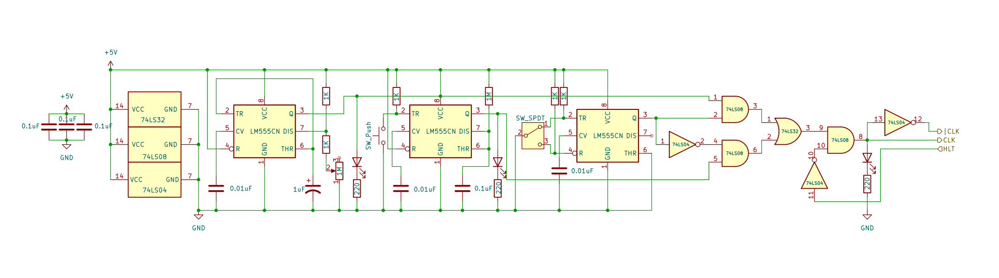

# 8 bits Breadboard Computer - Electronic diagrams

## Registers
This computer has **2 working registers**, used for general purpose computations, and an **output register**

### [A Register](modules/A_register.md)
This register is the main working register, it has **read** and **write** capabilities and is directly connected to the ALU.

Its main purpose is to store the **primary operand** of any computation.

### [B Register](modules/B_register.md)
This register is the secondary working register, it only has **write** capabilities and is directly connected to the ALU.

Its purpose is to store the **secondary operand** of any computation.

### [Output Register](modules/output_register.md)
This register has one purpose, to display the result of a computation in a user-friendly manner, it only has **write** capabilities and display can be switch from signed to unsigned. 

## Memory Management
In this computer, **RAM reads and writes** are totally **synchronous**, and no slower to access than any registers.
Memory address is selected using the **Memory Address Register** after that, **Memory** operate juste like any other register.

### [Memory Address Register](modules/memory_address_register.md)
This register's only purpose is to hold the currently selected memory address, it's output is directly connected to the address lines of the **Memory module**

It also holds control over "Manual programming mode" using a static switch, in this state, the memory address pointer is controller by a 8DIP switch.

### [Memory](modules/memory.md)
The memory module is responsible to hold all the data of the computer and should be capable of being addressed by an 8 bit value.

This module is enslaved to the **Memory Address Register**'s **Manual programming mode** switch, in this state, the written value is controlled by an 8DIP switch.

## Execution Logic
The execution logic is composed of 3 primary components, responsible for addressing, executing and keeping track of the current state and instructions.

### [Program Counter](modules/program_counter.md)
The program counter is responsible for keeping track of where in the execution the computer currently is, it has the ability to be programmatically set by branching instructions

### [Arithmetic Unit](modules/alu.md)
The alu is the main brain of the computer, it's the component that actually perform computation and is the only way to interact with the status register and execute conditional branching instructions
It has 2 modes, the first being simple addition, the second being 2's complement subtraction (A - B)

### [Status Register](modules/status_register.md)
The last component of the execution logic is the status register, it holds **Flags** regarding the last computation.

The 4 flags are :
- **Overflow** if the result has changed sign, this flag is only relevant if you consider your values as signed integers.
- **Zero** if the result of the computation is 0.
- **Carry** if the previous operation has produced a carry to ripple out of the 8 bit range.
- **Negative** if the most significant bit of the result is set to 1, meaning a negative number if in signed mode .

## Control Logic
The last key part of the computer, is the control logic that will enable every component to work together as one unit.

### [Clock Module](modules/clock.md)
The clock module is at the bottom of the pyramid, it dictat the rythme to all other component and synchronize them.

This module can operate on itself or switch to "Manual" mode, in which the clock signal is controller by a psh button for debug purposes.

### [Instruction Register](modules/instruction_register.md)
The instruction register is similar to the **Memory Address Register** but hold the opcode of the currently executing instruction.

Its output is directly connected to the **Control Unit**

### [Control Unit](modules/control_unit.md)
Finally, the last component is one of the most important, as it will tell each other component, what to do and when to do it depending on the current execution context 

