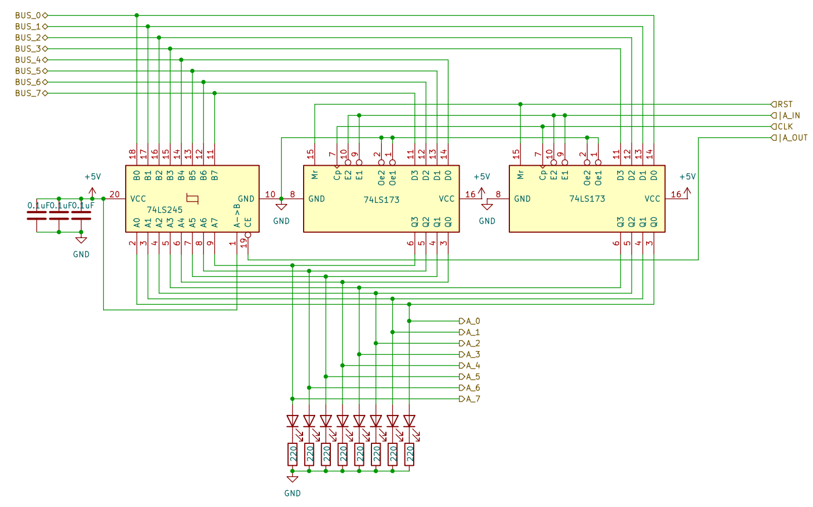

# 8 bits Breadboard Computer - A Register

## Diagram

## Description

### Signals
| Signal |        Mode |          Binary mask          |                                   Description |
|:-------|------------:|:-----------------------------:|----------------------------------------------:|
| A_IN   |  Active_LOW | 0000_0000_0000_0100_0000_0000 | Will capture the BUS's value at the next @CLK |
| A_OUT  |  Active_LOW | 0000_0000_0000_1000_0000_0000 |           Writes the current value to the BUS |
| RST    | Active_HIGH |               X               |               Reset the register's value to 0 |
| CLK    | Active_HIGH |               X               |                         The main clock signal |

### I/O
| Name |   Size |     Type |                                    Description |
|:-----|-------:|---------:|-----------------------------------------------:|
| BUS  | 8 bits | In / Out |                   Direct connection to the BUS |
| A    | 8 bits |      Out | Output of the register, before the Transceiver |

## Parts list
| Part                                    | Quantity | Unit Price |
|:----------------------------------------|---------:|-----------:|
| Breadboard BB830                        |        1 |     8,12 € |
| 220Ω Resistor                           |        8 |     0,02 € |
| 0,1µF Capacitor                         |        3 |     0,37 € |
| CD74HCT173E (4 bits Register)           |        2 |     0,73 € | 
| CD74HCT245E (8 bits Bus Transceiver)    |        1 |     0,80 € |
| Red LED                                 |        8 |     0,12 € |
