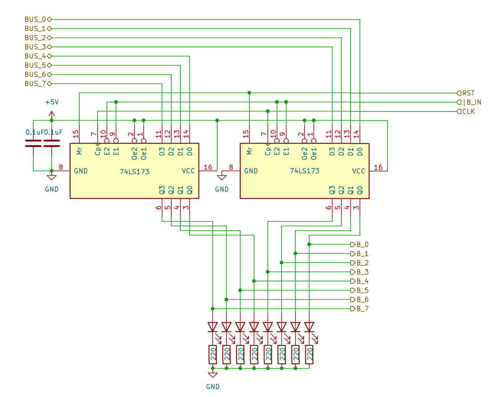

# 8 bits Breadboard Computer - B Register

## Diagram

## Description
This register has no bus output because of technical limitations (signal count must be kept under 24)

### Signals
| Signal |        Mode |          Binary mask          |                                   Description |
|:-------|------------:|:-----------------------------:|----------------------------------------------:|
| B_IN   |  Active_LOW | 0000_0000_0001_0000_0000_0000 | Will capture the BUS's value at the next @CLK |
| RST    | Active_HIGH |               X               |               Reset the register's value to 0 |
| CLK    | Active_HIGH |               X               |                         The main clock signal |

### I/O
| Name |   Size |     Type |                  Description |
|:-----|-------:|---------:|-----------------------------:|
| BUS  | 8 bits |       In | Direct connection to the BUS |
| B    | 8 bits |      Out |       Output of the register |

## Parts list
| Part                                   | Quantity | Unit Price |
|:---------------------------------------|---------:|-----------:|
| Breadboard BB830                       |        1 |     8,12 € |
| 220Ω Resistor                          |        8 |     0,02 € |
| 0,1µF Capacitor                        |        2 |     0,37 € |
| CD74HCT173E (4 bits Register)          |        2 |     0,73 € |
| Red LED                                |        8 |     0,12 € |
