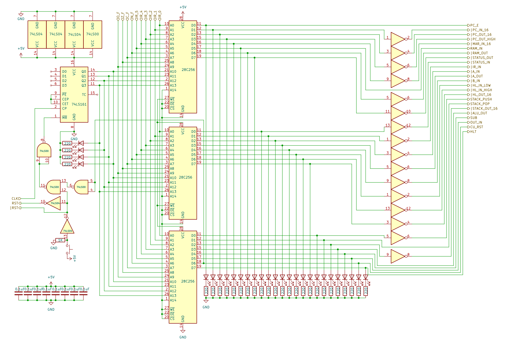

# 8 bits Breadboard Computer - Control Unit

## Diagram


## Description
Internally, each instruction has a certain number of micro-steps, this is handled by a 4bits counter that will keep track of the current micro-step.
Each instruction should therefore has a last micro-step that is responsible for resetting the counter.

The 3 EEPROMs are used as combinational logic substitutes, the address is of the form
```
Step(4bit)_Flags(4bit)_opcode(6bit)
```
The RST signal is controlled by a Push Switch on this module
The CLK signal will be used to increase the Step Counter

A subset of signals is inverted, this is due to the fact that in their respective modules, they are **Active_LOW**, the inverting logic in handle centrally instead of having a chip on each module

### Signals
| Signal |        Mode |     Binary mask     |           Description |
|:-------|------------:|:-------------------:|----------------------:|
| CLK    | Active_HIGH |          X          | The main clock signal |

### I/O
| Name |   Size | Type |                                              Description |
|:-----|-------:|-----:|---------------------------------------------------------:|
| IR   | 6 bits |   In | The 6 least significant bits of the Instruction Register |
| *_F  | 4 bits |   In |      The 4 least significant bits of the Status Register |

## Parts list
| Part                         | Quantity | Unit Price |
|:-----------------------------|---------:|-----------:|
| Breadboard BB830             |        2 |     8,12 € |
| 220Ω Resistor                |       20 |     0,02 € |
| 0,1µF Capacitor              |        8 |     0,37 € |
| CD74HCT00E (4x 2-NANDs)      |        1 |     0,57 € |
| CD74HCT04E (8x Inverters)    |        3 |     0,51 € |
| CD74HCT161E (4 bits Counter) |        1 |     0,69 € |
| AT28C256-15PU                |        3 |    10,81 € |
| Yellow LED                   |        4 |     0,23 € |
| Blue LED                     |       24 |     0,40 € |
| Push Button                  |        1 |     0,20 € |
