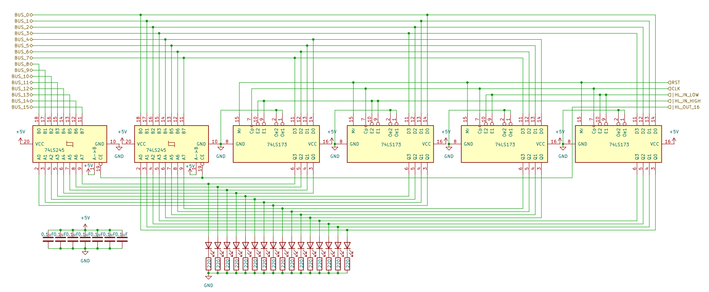

# 8 bits Breadboard Computer - HL Register

## Diagram

## Description

### Signals
| Signal     |        Mode |          Binary mask          |                                                Description |
|:-----------|------------:|:-----------------------------:|-----------------------------------------------------------:|
| HL_IN_LOW  |  Active_LOW | 0000_0000_0010_0000_0000_0000 | Will capture the BUS's value in the 8 LSB at the next @CLK |
| HL_IN_HIGH |  Active_LOW | 0000_0000_0100_0100_0000_0000 | Will capture the BUS's value in the 8 MSB at the next @CLK |
| HL_OUT_16  |  Active_LOW | 0000_0000_1000_1000_0000_0000 |                        Writes the current value to the BUS |
| RST        | Active_HIGH |               X               |                            Reset the register's value to 0 |
| CLK        | Active_HIGH |               X               |                                      The main clock signal |

### I/O
| Name |    Size |     Type |                                    Description |
|:-----|--------:|---------:|-----------------------------------------------:|
| BUS  | 16 bits | In / Out |                   Direct connection to the BUS |
| A    |  8 bits |      Out | Output of the register, before the Transceiver |

## Parts list
| Part                                    | Quantity |
|:----------------------------------------|---------:|
| Breadboard BB830                        |        1 |
| 220Ω Resistor                           |       16 |
| 0,1µF Capacitor                         |        6 |
| CD74HCT173E (4 bits Register)           |        4 | 
| CD74HCT245E (8 bits Bus Transceiver)    |        2 |
| Red LED                                 |       16 |
