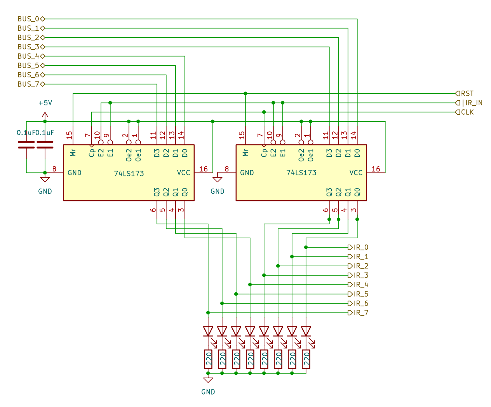

# 8 bits Breadboard Computer - Instruction Register

## Diagram

## Description

### Signals
| Signal |        Mode |          Binary mask          |                                   Description |
|:-------|------------:|:-----------------------------:|----------------------------------------------:|
| IR_IN  |  Active_LOW | 0000_0000_0000_0010_0000_0000 | Will capture the BUS's value at the next @CLK |
| RST    | Active_HIGH |               X               |               Reset the register's value to 0 |
| CLK    | Active_HIGH |               X               |                         The main clock signal |

### I/O
| Name |   Size |     Type |                  Description |
|:-----|-------:|---------:|-----------------------------:|
| BUS  | 8 bits |       In | Direct connection to the BUS |
| IR   | 6 bits |      Out |       Output of the register |

## Parts list
| Part                          | Quantity |
|:------------------------------|---------:|
| Breadboard BB830              |        1 |
| 220Ω Resistor                 |        8 |
| 0,1µF Capacitor               |        2 |
| CD74HCT173E (4 bits Register) |        2 |
| Yellow LED                    |        8 |
