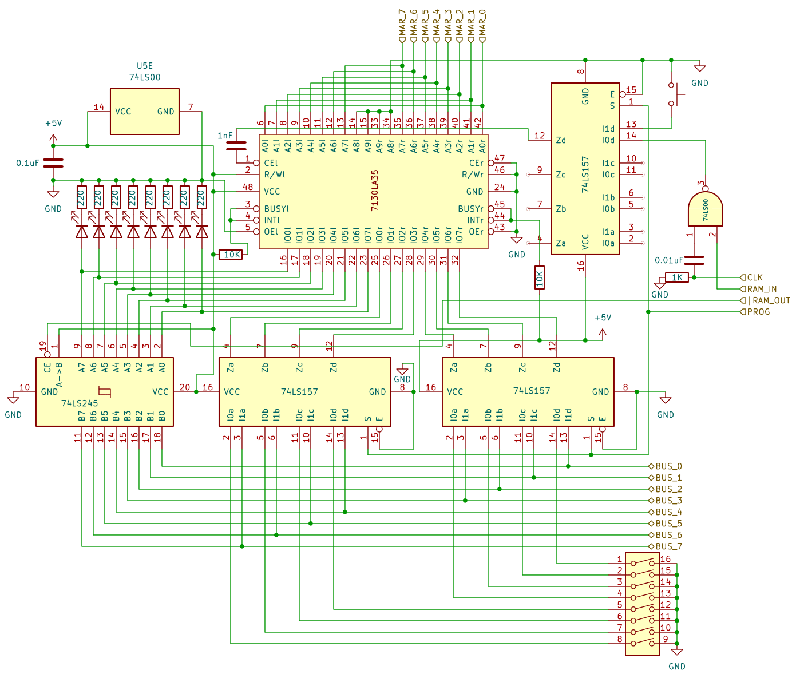

# 8 bits Breadboard Computer - Memory

## Diagram

## Description
The module can be switched in **Manual Programming Mode**, in that state, the value read from the bus is overridden by a 8DIP Switch, and the clock and **RAM_IN** signals are overridden by a Push Switch.

Electrical diagram not tested, Not that sure that the arrangement of the 2 74HCT245 will not cause issues when switching, may be subject to reworks during assembly

### Signals
| Signal  |        Mode |     Binary mask     |                                                                        Description |
|:--------|------------:|:-------------------:|-----------------------------------------------------------------------------------:|
| RAM_IN  | Active_HIGH | 0000_0000_0010_0000 | Will capture the BUS's value at the next @CLK and store it at the selected address |
| RAM_OUT |  Active_LOW | 0000_0000_0100_0000 |                         Puts the current value at the selected address on the BUSS |
| PROG    | Active_HIGH |          X          |                                 Will set the module in **Manual Programming Mode** |
| CLK     | Active_HIGH |          X          |                                                              The main clock signal |

### I/O
| Name |    Size |     Type |                                      Description |
|:-----|--------:|---------:|-------------------------------------------------:|
| BUS  |  8 bits | In / Out |                     Direct connection to the BUS |
| MAR  | 16 bits |       In | Direct output of the **Memory Address Register** |

## Parts list
| Part                                   | Quantity | Unit Price |
|:---------------------------------------|---------:|-----------:|
| Breadboard BB830                       |        2 |     8,12 € |
| 220Ω Resistor                          |        8 |     0,02 € |
| 1kΩ Resistor                           |        1 |     0,03 € |
| 10kΩ Resistor                          |        2 |     0,05 € |
| 1nF Capacitor                          |        1 |     0,56 € |
| 0,01µF Capacitor                       |        1 |     0,28 € |
| 0,1µF Capacitor                        |        5 |     0,37 € |
| CD74HCT00E (4x 2-NANDs)                |        1 |     0,57 € |
| CD74HCT157E (2 lines to 1 bit Encoder) |        1 |     0,81 € |
| CD74HCT245E (8 bits Bus Transceiver)   |        2 |     0,80 € |
| AS6C1008-55PIN                         |        1 |     5,32 € |
| Red LED                                |        8 |     0,12 € |
| 8 bits DIP switch                      |        1 |     1,64 € |
