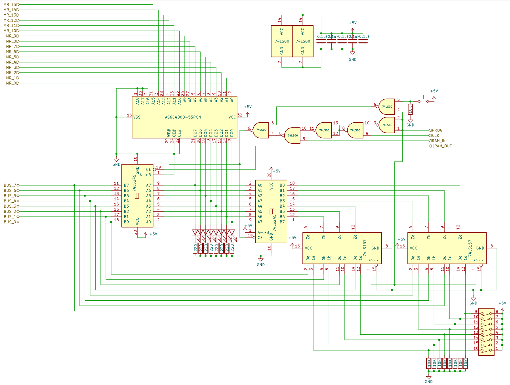

# 8 bits Breadboard Computer - Memory

## Diagram

## Description
The module can be switched in **Manual Programming Mode**, in that state, the value read from the bus is overridden by a 8DIP Switch, and the clock and **RAM_IN** signals are overridden by a Push Switch.

This module uses a Dual Channel SRAM CMOS chip, but uses it as a Single Channel Chip and dissociate input and output pins, to achieve this, the 2 channels are routed to the same address, and one is hardwired to **Read** mode as the other is hardwired to **Write** mode,

The **Write Channel** has its ``CE`` pin clocked when **RAM_IN** is set and CLK is pulsed, the other channel has its ``CE`` pin hardwired to low to always output its content to the inputs of the transceiver.

A 1nF capacitor is wired in between the clock selector and the ``CE`` pin to absorb potential current and voltage spikes occurring when mode switching.

### Signals
| Signal  |        Mode |     Binary mask     |                                                                        Description |
|:--------|------------:|:-------------------:|-----------------------------------------------------------------------------------:|
| RAM_IN  | Active_HIGH | 0000_0000_0001_0000 | Will capture the BUS's value at the next @CLK and store it at the selected address |
| RAM_OUT |  Active_LOW | 0000_0000_0010_0000 |                         Puts the current value at the selected address on the BUSS |
| PROG    | Active_HIGH |          X          |                                 Will set the module in **Manual Programming Mode** |
| CLK     | Active_HIGH |          X          |                                                              The main clock signal |

### I/O
| Name |   Size |     Type |                                      Description |
|:-----|-------:|---------:|-------------------------------------------------:|
| BUS  | 8 bits | In / Out |                     Direct connection to the BUS |
| MAR  | 8 bits |       In | Direct output of the **Memory Address Register** |

## Parts list

| Part                                  | Quantity | Unit Price |   Total |                                                                                                                                                                                                                                                                                                                                                                                                                                                                                                                                                                                                                                         Link |
|:--------------------------------------|---------:|-----------:|--------:|---------------------------------------------------------------------------------------------------------------------------------------------------------------------------------------------------------------------------------------------------------------------------------------------------------------------------------------------------------------------------------------------------------------------------------------------------------------------------------------------------------------------------------------------------------------------------------------------------------------------------------------------:|
| Breadboard BB830                      |        2 |     8,12 € | 16,24 € |                                                                                                                                                                                                                                                                                                                                                                                                                                                                                                                                 [Link](https://www.mouser.fr/ProductDetail/BusBoard-Prototype-Systems/BB830?qs=VEfmQw3KOauhPeTwYxNCaA%3D%3D) |
| 220Ω Resistor                         |        8 |     0,02 € |  0,16 € |                                                                                                                                                                                                                                                                                                                                                                                                                                                                                                                                         [Link](https://www.mouser.fr/ProductDetail/YAGEO/CFR-25JT-52-220R?qs=KUIzHt%2Fe91lrctWTReofaw%3D%3D) |
| 1kΩ Resistor                          |        1 |     0,03 € |  0,03 € |                                                                                                                                                                                                                                                                                                                                                                                                                                                                                                                           [Link](https://www.mouser.fr/ProductDetail/YAGEO/CFR-25JR-52-1K?qs=sGAEpiMZZMtlubZbdhIBIG2rwDeDG2Hz0nFs2Ia3WF8%3D) |
| 10kΩ Resistor                         |        2 |     0,05 € |  0,10 € |                                                                                                                                                                                                                                                                                                                                                                                                                                                                                                                      [Link](https://www.mouser.fr/ProductDetail/YAGEO/CFR25SJT-26-10K?qs=sGAEpiMZZMtlubZbdhIBIMMVXX%252BgggzkNaoPvJwEHrI%3D) |
| 1nF Capacitor                         |        1 |     0,56 € |  0,56 € |                                                                                                                                                                                                                                                                                                                                                                                                                                                                                                                            [Link](https://www.mouser.fr/ProductDetail/Vishay-BC-Components/K102J15C0GF53H5G?qs=DPoM0jnrROVTxjmlWxnrvw%3D%3D) |
| 0,01µF Capacitor                      |        1 |     0,28 € |  0,28 € |                                                                                                                                                                                                                                                                                                                                                                                                                                                                                                      [Link](https://www.mouser.fr/ProductDetail/Murata-Electronics/RDER71H103K0K1H03B?qs=sGAEpiMZZMsh%252B1woXyUXjxDBwwEQMMyX8THmGZDylx4%3D) |
| 0,1µF Capacitor                       |        1 |     0,37 € |  0,37 € |                                                                                                                                                                                                                                                                                                                                                                                                                                                                                                [Link](https://www.mouser.fr/ProductDetail/Vishay-BC-Components/K104K15X7RF53H5G?qs=sGAEpiMZZMsh%252B1woXyUXj30ZYomYlxpXf%2Fk4SX%252BaKhs%3D) |
| SN74LS00N (4x 2-NANDs)                |        1 |     0,61 € |  0,61 € |                                                                                                                                                                                                                                                                                                                                                                                                                                                                                                                                  [Link](https://www.mouser.lu/ProductDetail/Texas-Instruments/SN74LS00N?qs=spW5eSrOWB6G5wECF%252BEZFA%3D%3D) |
| SN74LS157N (2 lines to 1 bit Encoder) |        3 |     0,82 € |  2,46 € |                                                                                                                                                                                                                                                                                                                                                                                                                                                                                                                                     [Link](https://www.mouser.lu/ProductDetail/Texas-Instruments/SN74LS157N?qs=LzFo6vGRJ4stINDkpW5nIA%3D%3D) |
| SN74LS245N (8 bits Bus Transceiver)   |        1 |     1,15 € |  1,15 € |                                                                                                                                                                                                                                                                                                                                                                                                                                                                                                                                   [Link](https://www.mouser.lu/ProductDetail/Texas-Instruments/SN74LS245N?qs=tJ5HNKWh3OU3CUIGSPX6%2Fg%3D%3D) |
| 7130LA35                              |        1 |    12,82 € | 12,82 € |                                                                                                                                                                                                                                                                                                                                                                                        [Link](https://www.mouser.fr/ProductDetail/Renesas-Electronics/7130LA35PDG?qs=JcGQCygHkIbDTyiFe0PjnA%3D%3D&countrycode=US&currencycode=USD&_gl=1*3if4y7*_ga*MTAzNTM5OTYxNi4xNzE2ODM0NzE1*_ga_15W4STQT4T*MTcxNjgzNDcxNS4xLjEuMTcxNjgzNDk4MS4yMi4wLjA.) |
| Red LED                               |        8 |     0,12 € |  0,96 € |                                                                                                                                                                                                                                                                                                                                                                                                                                                                                                                                              [Link](https://www.mouser.lu/ProductDetail/Kingbright/WP7113YT?qs=YPg7lQ8MWSfGn6TgDjFnaQ%3D%3D) |
| 8 bits DIP switch                     |        1 |     1,64 € |  1,64 € |                                                                                                                                                                                                                                                                                                                                                                                                                                                                                                                                                [Link](https://www.mouser.lu/ProductDetail/E-Switch/KAS1108E?qs=f57gQzlyLiprZHQecsfCqA%3D%3D) |
