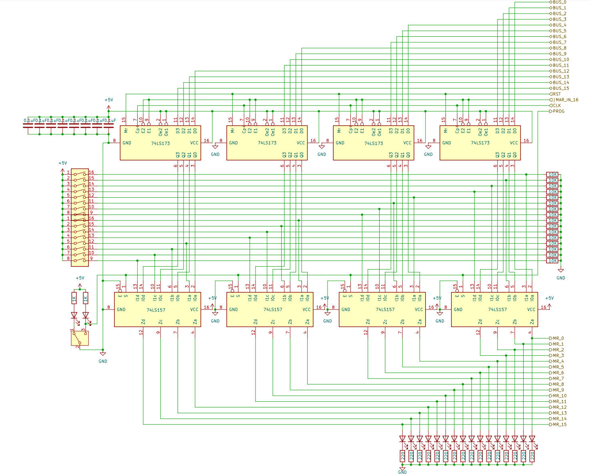

# 8 bits Breadboard Computer - Memory Address Register

## Diagram

## Description
This register holds the pointer of the current RAM address, it also controls the **Manual Programming Mode** switch

### Signals
| Signal |        Mode |     Binary mask     |                                   Description |
|:-------|------------:|:-------------------:|----------------------------------------------:|
| MR_IN  |  Active_LOW | 0000_0000_0000_1000 | Will capture the BUS's value at the next @CLK |
| RST    | Active_HIGH |          X          |               Reset the register's value to 0 |
| CLK    | Active_HIGH |          X          |                         The main clock signal |

### I/O
| Name |   Size | Type |                                         Description |
|:-----|-------:|-----:|----------------------------------------------------:|
| BUS  | 8 bits |   In |                        Direct connection to the BUS |
| MR   | 8 bits |  Out |                              Output of the register |
| PROG | 1 bits |  Out |  Will set the module in **Manual Programming Mode** |

## Parts list

| Part                                    | Quantity | Unit Price |  Total |                                                                                                                                                                                                                                                                                                                                                                                                                                                                                                                                                                                                                                         Link |
|:----------------------------------------|---------:|-----------:|-------:|---------------------------------------------------------------------------------------------------------------------------------------------------------------------------------------------------------------------------------------------------------------------------------------------------------------------------------------------------------------------------------------------------------------------------------------------------------------------------------------------------------------------------------------------------------------------------------------------------------------------------------------------:|
| Breadboard BB830                        |        1 |     8,12 € | 8,12 € |                                                                                                                                                                                                                                                                                                                                                                                                                                                                                                                                 [Link](https://www.mouser.fr/ProductDetail/BusBoard-Prototype-Systems/BB830?qs=VEfmQw3KOauhPeTwYxNCaA%3D%3D) |
| 220Ω Resistor                           |        8 |     0,02 € | 0,16 € |                                                                                                                                                                                                                                                                                                                                                                                                                                                                                                                                         [Link](https://www.mouser.fr/ProductDetail/YAGEO/CFR-25JT-52-220R?qs=KUIzHt%2Fe91lrctWTReofaw%3D%3D) |
| 1kΩ Resistor                            |        2 |     0,03 € | 0,06 € |                                                                                                                                                                                                                                                                                                                                                                                                                                                                                                                           [Link](https://www.mouser.fr/ProductDetail/YAGEO/CFR-25JR-52-1K?qs=sGAEpiMZZMtlubZbdhIBIG2rwDeDG2Hz0nFs2Ia3WF8%3D) |
| 0,1µF Capacitor                         |        1 |     0,37 € | 0,37 € |                                                                                                                                                                                                                                                                                                                                                                                                                                                                                                [Link](https://www.mouser.fr/ProductDetail/Vishay-BC-Components/K104K15X7RF53H5G?qs=sGAEpiMZZMsh%252B1woXyUXj30ZYomYlxpXf%2Fk4SX%252BaKhs%3D) |
| SN74LS173AN (4 bits Register)           |        2 |     1,66 € | 3,32 € |                                                                                                                                                                                                                                                                                                                                                                                                                                                                                                                                    [Link](https://www.mouser.lu/ProductDetail/Texas-Instruments/SN74LS173AN?qs=nMmhAzRCgdAkY4Cck6ihbQ%3D%3D) |
| SN74LS157N (2 lines to 1 bit Encoder)   |        2 |     0,82 € | 1,64 € |                                                                                                                                                                                                                                                                                                                                                                                                                                                                                                                                     [Link](https://www.mouser.lu/ProductDetail/Texas-Instruments/SN74LS157N?qs=LzFo6vGRJ4stINDkpW5nIA%3D%3D) |
| Yellow LED                              |        1 |     0,23 € | 0,23 € |                                                                                                                                                                                                                                                                                                                                                                                                                                                                                                                                              [Link](https://www.mouser.lu/ProductDetail/Kingbright/WP7113YT?qs=YPg7lQ8MWSfGn6TgDjFnaQ%3D%3D) |
| Green LED                               |        1 |     0,16 € | 0,16 € |                                                                                                                                                                                                                                                                                                                                                                                                                                                                                                                                              [Link](https://www.mouser.lu/ProductDetail/Kingbright/WP7113GT?qs=pz0eHrWKk7l3r4lHAQVJ9A%3D%3D) |
| Red LED                                 |        8 |     0,12 € | 0,96 € |                                                                                                                                                                                                                                                                                                                                                                                                                                                                                                                                           [Link](https://www.mouser.lu/ProductDetail/Lumex/SSL-LX5093IT?qs=z5hCOXTvo57cxO7p%252BvLJIw%3D%3D) |
| 8 bits DIP switch                       |        1 |     1,64 € | 1,64 € |                                                                                                                                                                                                                                                                                                                                                                                                                                                                                                                                                [Link](https://www.mouser.lu/ProductDetail/E-Switch/KAS1108E?qs=f57gQzlyLiprZHQecsfCqA%3D%3D) |
| Toggle Switch                           |        1 |     1,09 € | 1,09 € |                                                                                                                                                                                                                                                                                                                                                                                                                                                                                                                        [Link](https://www.mouser.lu/ProductDetail/TE-Connectivity-Alcoswitch/MHS12204?qs=x%2FgbKjZ2T%2FPUluB%2FWhqq0Q%3D%3D) |
