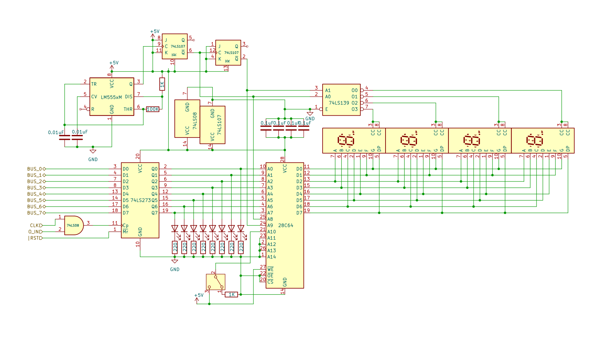

# 8 bits Breadboard Computer - Output Register

## Diagram

## Description
This register will display its value as a decimal value that can be signed or not.

It will drive 4 7 segments display using the same data lines and one EEPROM. this is managed by rapidly switching on and off each display and relying on persistance of vision.

To do so we use a 555 Timer to get a consistent clock signal, and use 2 JK-Flip-Flop to simulate a 2 bit binary counter, this value is used as the 2 MSB of the EEPROM Address to differentiate each digit of a number.
We also use a 2bit to 4 lines selector to activate and deactivate each display one at a time.
This will have the effect of making each display display a different number, creating the illusion of driving all the 7 segment displays at the same time with a quarter of the data lines 

A Switch can control if the value is displayed as signed or not.

### Signals
| Signal |        Mode |          Binary mask          |                                   Description |
|:-------|------------:|:-----------------------------:|----------------------------------------------:|
| OUT_IN | Active_HIGH | 0010_0000_0000_0000_0000_0000 | Will capture the BUS's value at the next @CLK |
| RST    |  Active_LOW |               X               |               Reset the register's value to 0 |
| CLK    | Active_HIGH |               X               |                         The main clock signal |

### I/O
| Name |   Size |     Type |                  Description |
|:-----|-------:|---------:|-----------------------------:|
| BUS  | 8 bits |       In | Direct connection to the BUS |

## Parts list
| Part                                    | Quantity | Unit Price |
|:----------------------------------------|---------:|-----------:|
| Breadboard BB830                        |        2 |     8,12 € |
| 220Ω Resistor                           |        8 |     0,02 € |
| 1kΩ Resistor                            |        2 |     0,03 € |
| 100kΩ Resistor                          |        1 |     0,04 € |
| 0,01µF Capacitor                        |        2 |     0,28 € |
| 0,1µF Capacitor                         |        4 |     0,37 € |
| LM555CN (Timer)                         |        1 |     1,21 € |
| CD74HCT08E (4x 2-ANDs)                  |        1 |     0,55 € |
| CD74HCT107E (Dual JK-Flip-Flops)        |        1 |     0,84 € |
| CD74HCT139E (2 bits to 4 lines Decoder) |        1 |     0,74 € |
| CD74HCT273E (8x D-Flip-Flops)           |        1 |     0,93 € |
| AT28C64B-15PU                           |        1 |     5,12 € |
| Red LED                                 |        8 |     0,12 € |
| Toggle Switch                           |        1 |     1,09 € |
| 7 Segments Display                      |        4 |     1,92 € |
