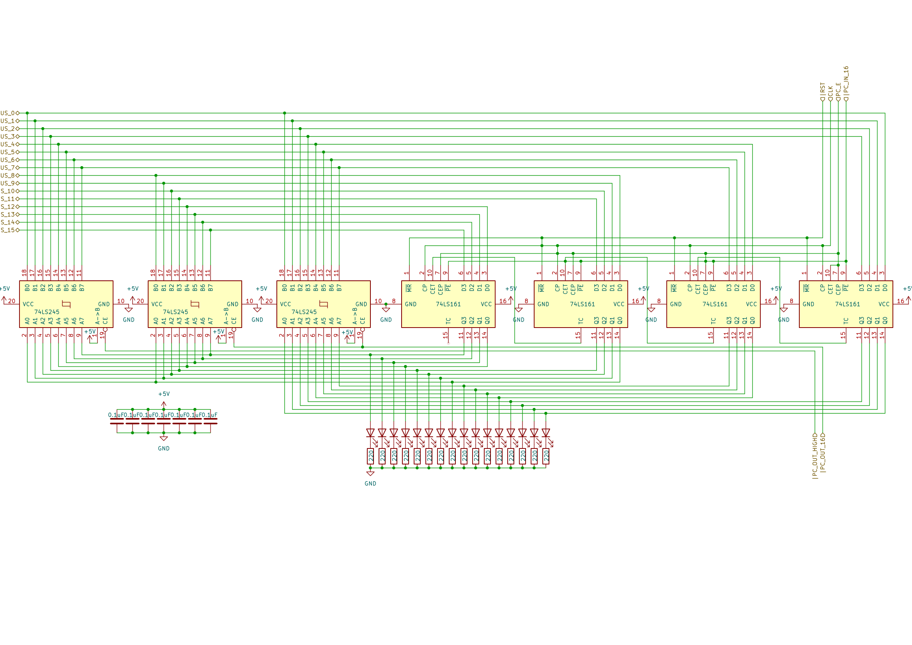

# 8 bits Breadboard Computer - Program Counter

## Diagram

## Description
The 4 CD74HCT161E are connected in series, to achieve a 16 bit binary counter.

### Signals
| Signal      |        Mode |          Binary mask          |                                            Description |
|:------------|------------:|:-----------------------------:|-------------------------------------------------------:|
| PC_E        | Active_HIGH | 0000_0000_0000_0000_0000_0001 |                     Will count up one at the next @CLK |
| PC_IN_16    |  Active_LOW | 0000_0000_0000_0000_0000_0010 |          Will capture the BUS's value at the next @CLK |
| PC_OUT_16   |  Active_LOW | 0000_0000_0000_0000_0000_0100 |      Writes the current value to the BUS (all 16 bits) |
| PC_OUT_HIGH |  Active_LOW | 0000_0000_0000_0000_0000_1000 | Writes the 8 MSB current value to the 8 LSB of the BUS |
| RST         |  Active_LOW |               X               |                        Reset the register's value to 0 |
| CLK         | Active_HIGH |               X               |                                  The main clock signal |

### I/O
| Name |    Size |     Type |                  Description |
|:-----|--------:|---------:|-----------------------------:|
| BUS  | 16 bits | In / Out | Direct connection to the BUS |

## Parts list
| Part                                    | Quantity |
|:----------------------------------------|---------:|
| Breadboard BB830                        |        2 |
| 220Ω Resistor                           |       16 |
| 0,1µF Capacitor                         |        7 |
| CD74HCT161E (4 bits Counter)            |        4 |
| CD74HCT245E (8 bits Bus Transceiver)    |        3 |
| Red LED                                 |       16 |
