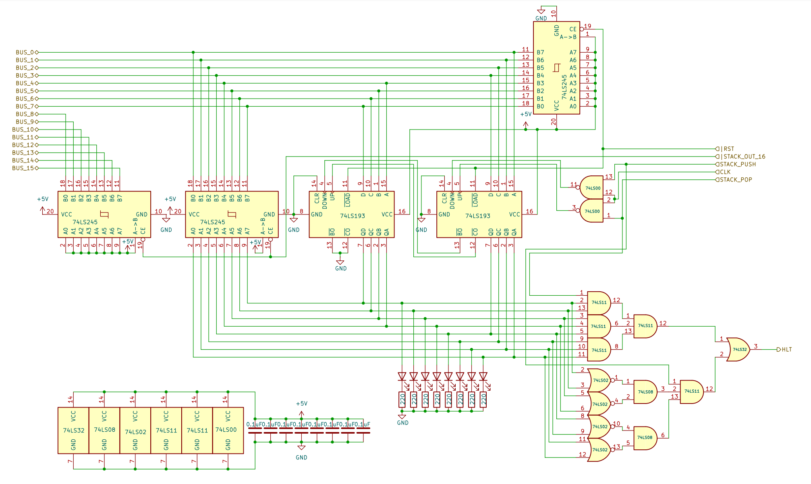

# 8 bits Breadboard Computer - Stack Pointer

## Diagram

## Description
The ``HTL`` signal will be pulled HIGH if an operation that will trigger an overflow is requested (thus preventing the next clock cycle from occurring) :
- All bits are 0 and the ``STACK_PUSH`` is HIGH (this would trigger a roll-over from #00 to #FF, when decrementing)
- All bits are 1 and the ``STACK_POP`` is HIGH (this would trigger an overflow from #FF to #00, when incrementing)

The reset signal is tight to a CD74HCT245E because à reset of the stack pointer should set it to the top of the stack address space, which is #FF,
so when ``RST`` is triggered, we force-feed that value onto the bus, this should not cause any harm as when resetting, nothing else should read from the bus.

### Signals
| Signal       |          Mode |          Binary mask          |                                            Description |
|:-------------|--------------:|:-----------------------------:|-------------------------------------------------------:|
| STACK_PUSH   |   Active_HIGH | 0000_0001_0000_0000_0000_0000 |              Will increment the value on the next @CLK |
| STACK_POP    |   Active_HIGH | 0000_0010_0000_0000_0000_0000 |              Will decrement the value on the next @CLK |
| STACK_OUT_16 |    Active_LOW | 0000_0100_0000_0000_0000_0000 | Writes the current value to the BUS prepended with #FF |
| RST          |   Active_HIGH |               X               |                    Reset the register's value to #FFFF |
| CLK          |   Active_HIGH |               X               |                                  The main clock signal |

### I/O
| Name |    Size |     Type |                                    Description |
|:-----|--------:|---------:|-----------------------------------------------:|
| BUS  | 16 bits | In / Out |                   Direct connection to the BUS |

## Parts list
| Part                                 | Quantity |
|:-------------------------------------|---------:|
| Breadboard BB830                     |        2 |
| 220Ω Resistor                        |        8 |
| 0,1µF Capacitor                      |        7 |
| CD74HCT245E (8 bits Bus Transceiver) |        3 |
| CD74HCT00E (4x 2-NANDs)              |        1 |
| CD74HCT02E (4x 2-NORs)               |        1 |
| CD74HCT08E (4x 2-ANDs)               |        1 |
| CD74HCT11E (3x 3-ANDs)               |        2 |
| CD74HCT32E (4x 2-ORs)                |        2 |
| CD74HCT193E (4 bits UP/DOWN Counter) |        2 |
| Red LED                              |        8 |
