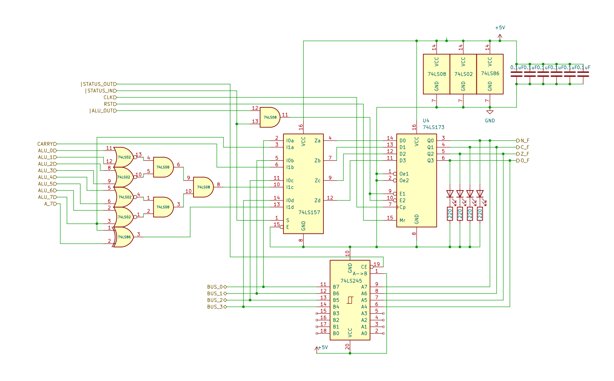

# 8 bits Breadboard Computer - Status Register

## Diagram

## Description
The status register is responsible for capturing the state of the ALU's flags after certain instructions.
#### Overflow
If the result has changed sign, this flag is only relevant if you consider your values as signed integers.

This flag will be set if the 8th bit of the A Register is different from the 8th bit of the result, we can compute is as follows ``(A_8 ^ R_8) != 0``

#### Zero 
If the result of the computation is 0.

This flag is set when all bits of the Result are 0, we can compute is as follows ``(~(R_0 | R_1) & ~(R_2 | R_3)) &(~(R_4 | R_5) & ~(R_6 | R_7))``
#### Carry 
If the previous operation has produced a carry to ripple out of the 8 bit range.

This flag is simply captured from the ALU's output **CARRY** signal

#### Negative 
If the most significant bit of the result is set to 1, meaning a negative number if in signed mode .

This flag is simply captured as the 8th bit of the result 

### Signals
| Signal     |        Mode |          Binary mask          |                                   Description |
|:-----------|------------:|:-----------------------------:|----------------------------------------------:|
| STATUS_IN  |  Active_LOW | 0000_0000_0000_0001_0000_0000 | Will capture the BUS's value at the next @CLK |
| STATUS_OUT |  Active_LOW | 0000_0000_0000_0000_1000_0000 |           Writes the current value to the BUS |
| ALU_OUT    |  Active_LOW | 0000_1000_0000_0000_0000_0000 |           Writes the current value to the BUS |
| RST        | Active_HIGH |               X               |               Reset the register's value to 0 |
| CLK        | Active_HIGH |               X               |                         The main clock signal |

### I/O
| Name   |   Size |     Type |                                           Description |
|:-------|-------:|---------:|------------------------------------------------------:|
| ALU    | 8 bits |       In |             Output of the ALU, before the transceiver |
| BUS    | 4 bits | In / Out |                          Direct connection to the BUS |
| A_8    |  1 bit |       In | The 8th bit of the A Register, before the transceiver |
| CARRY  |  1 bit |       In |                             The CARRY flag of the ALU |
| *_F    |  4 bit |      Out |          The 4 least significant bits of the Register |

## Parts list
| Part                                    | Quantity | Unit Price |
|:----------------------------------------|---------:|-----------:|
| Breadboard BB830                        |        1 |     8,12 € |
| 220Ω Resistor                           |        4 |     0,02 € |
| 0,1µF Capacitor                         |        4 |     0,37 € |
| CD74HCT173E (4 bits Register)           |        1 |     0,73 € |
| CD74HCT02E (4x 2-NORs)                  |        1 |     0,54 € |
| CD74HCT08E (4x 2-ANDs)                  |        1 |     0,55 € |
| CD74HCT86E (4x 2-XORs)                  |        1 |     0,81 € |
| CD74HCT157E (2 lines to 1 bit Encoder)  |        1 |     0,81 € |
| CD74HCT245E (8 bits Bus Transceiver)    |        1 |     0,80 € |
| Red LED                                 |        4 |     0,12 € |
